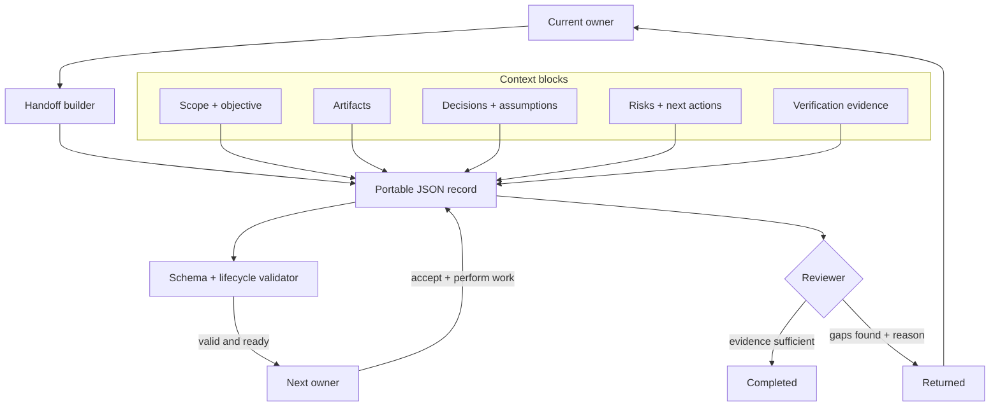
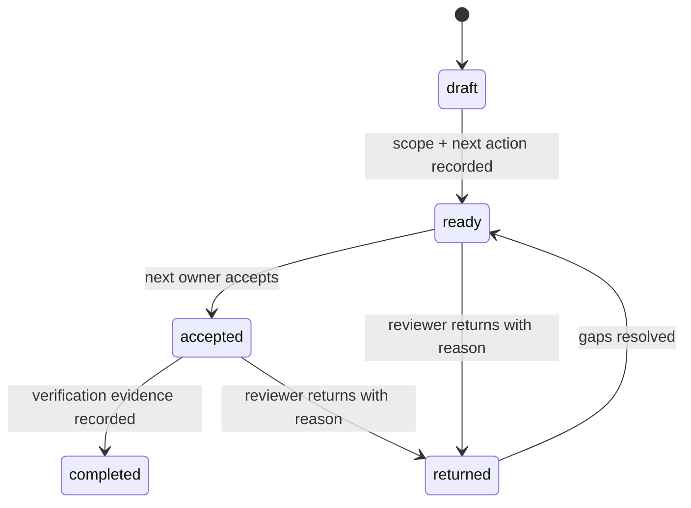

# Agent Handoff Kit


Small, durable handoff records for work that crosses AI agents, people, and automation tools.

Agent collaboration often loses the most important context: what changed, which assumptions remain valid, what is still in scope, who owns the next action, and what evidence proves completion. Agent Handoff Kit makes that transfer an explicit, vendor-neutral JSON record with a validated lifecycle.

## Who it is for

- Teams moving work between planning, implementation, and review agents
- Developers integrating multiple agent vendors or storage backends
- Humans who need to accept, return, or verify machine-generated work

## Run it

Requires Python 3.11+ and has no runtime dependencies.

```bash
git clone https://github.com/mahsan07/agent-handoff-kit.git
cd agent-handoff-kit
python -m pip install -e .
agent-handoff create handoff.json \
  --title "Review task bus" \
  --objective "Run tests and verify atomic claims" \
  --owner planner --next-owner reviewer-agent --reviewer human \
  --scope src --scope tests
agent-handoff add handoff.json next_actions "Run the full test suite"
agent-handoff add-artifact handoff.json --kind commit --uri abc123 --description "Implementation"
agent-handoff transition handoff.json ready --actor planner
agent-handoff validate handoff.json
```

Use `uv sync` and prefix commands with `uv run` if you prefer uv. A complete valid record is available at `examples/coding-handoff.json`.

## How it works



The JSON record carries context and ownership across tools. Validation controls status changes, while authorization to use tools remains outside the handoff.

## Lifecycle



The record separates artifacts, decisions, assumptions, risks, next actions, and verification evidence. A handoff conveys context; it never grants tool authorization.

## What is different

General multi-agent frameworks pass free-form messages inside one runtime. Agent Handoff Kit makes continuity portable outside any runtime: the same record can live in Git, a ticket, a database, or a filesystem queue. Its lifecycle rejects silent completion and requires evidence before `completed`.

The MVP ships a JSON Schema, standard-library validator, CLI, Python API, example record, and transition tests. It does not orchestrate workers or execute tools.

## Verify it

```bash
python -m unittest discover -s tests -v
agent-handoff validate examples/coding-handoff.json
```

See [architecture](docs/ARCHITECTURE.md), [portfolio ecosystem](docs/ECOSYSTEM.md), [product definition](docs/PRODUCT.md), [safety boundaries](docs/SAFETY.md), [roadmap](docs/ROADMAP.md), and [status](STATUS.md).

MIT licensed.
