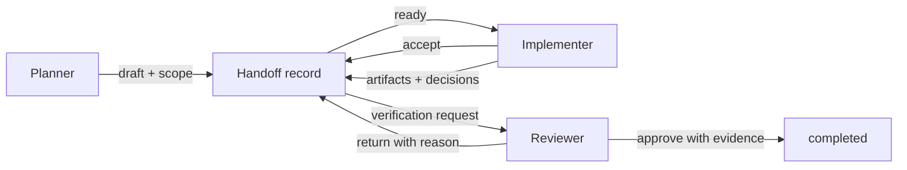

# Architecture

Agent Handoff Kit is a protocol layer, not an orchestrator. `handoff.schema.json` defines the portable record. The Python package adds lifecycle rules that JSON Schema alone cannot express, such as evidence required for completion.

## Record sections

| Section | Purpose |
| --- | --- |
| `scope` | Files, systems, or questions included |
| `artifacts` | Portable file, URL, commit, or note references |
| `decisions` | Choices already made and their durable outcome |
| `assumptions` | Claims the next owner should verify if material |
| `risks` | Known hazards and uncertainty |
| `next_actions` | Concrete work required from the next owner |
| `verification` | Evidence required before completion |

Persistence is deliberately external. The reference CLI reads and atomically rewrites one JSON file; applications may store the same schema elsewhere.
