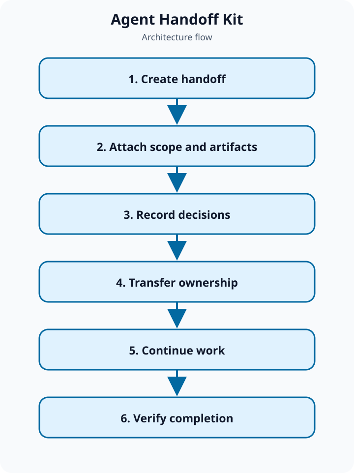
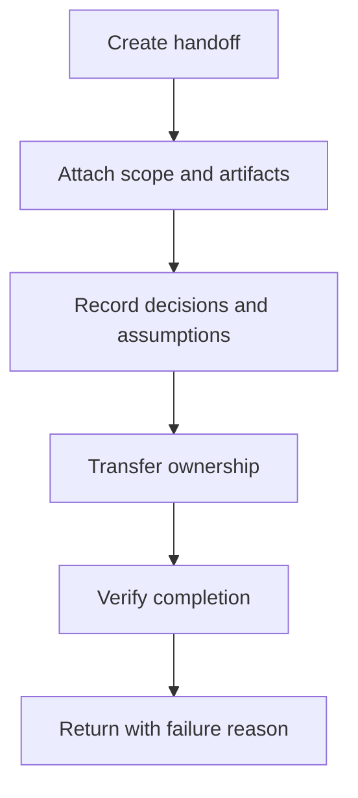
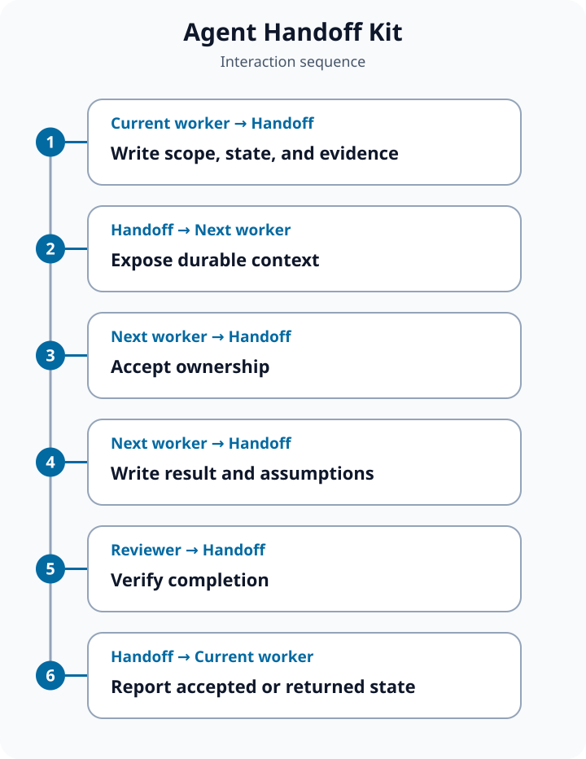
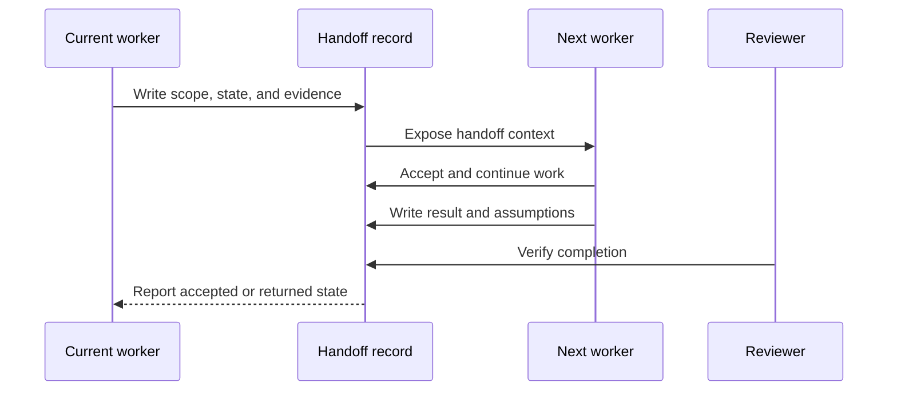

# Agent Handoff Kit diagrams

## Handoff flow

### Mermaid source

```mermaid
flowchart TD
  Create["Create handoff"] --> Scope["Attach scope and artifacts"]
  Scope --> Decide["Record decisions and assumptions"]
  Decide --> Transfer["Transfer ownership"]
  Transfer --> Verify["Verify completion"]
  Verify --> Return["Return with failure reason"]
```

## Handoff sequence

### Mermaid source

```mermaid
sequenceDiagram
  participant A as Current worker
  participant H as Handoff record
  participant N as Next worker
  participant R as Reviewer
  A->>H: Write scope, state, and evidence
  H->>N: Expose handoff context
  N->>H: Accept and continue work
  N->>H: Write result and assumptions
  R->>H: Verify completion
  H-->>A: Report accepted or returned state
```
